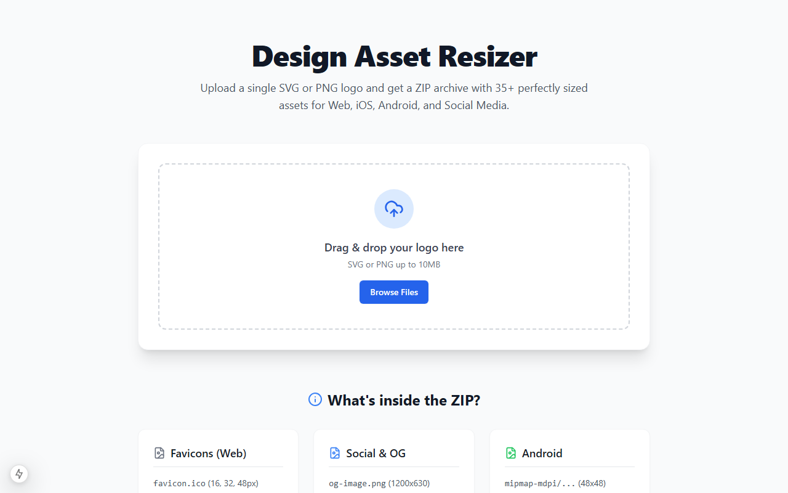
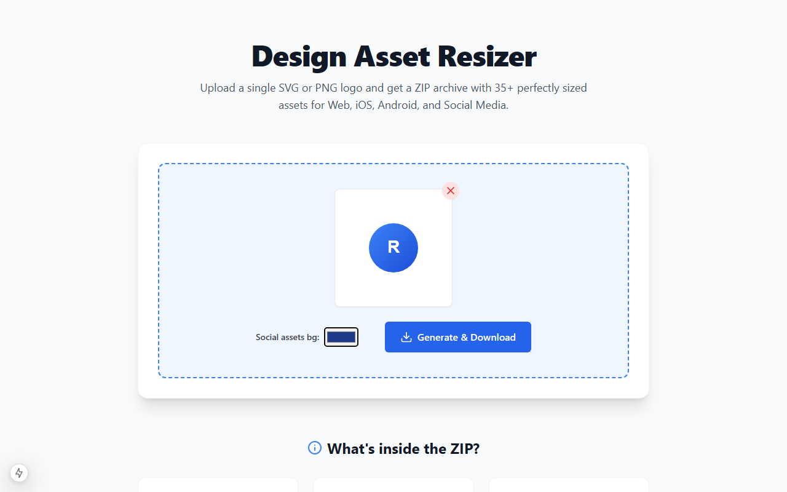
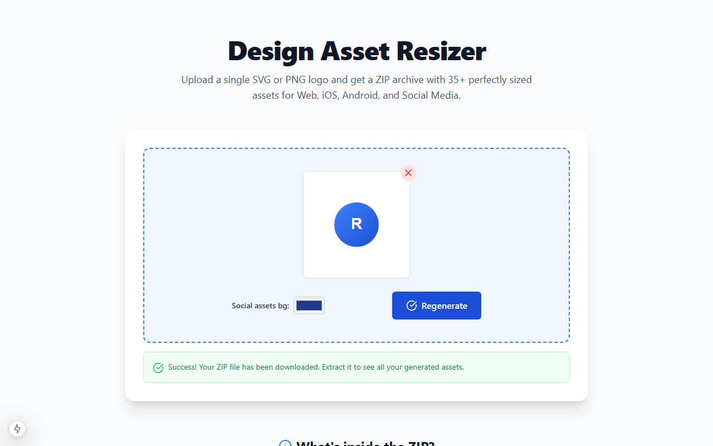

<div align="center">

# Design Asset Resizer

*Бесплатный генератор ассетов для приложений из одного логотипа*

<p align="center">
  <a href="README.md">English</a> • <a href="README_ru.md"><strong>Русский</strong></a>
</p>

[](https://nextjs.org/)
[](https://react.dev/)
[](https://tailwindcss.com/)
[](https://opensource.org/licenses/MIT)

</div>

---

## 🎨 О проекте

**Design Asset Resizer** — это быстрый, бесплатный инструмент (MVP), созданный для автоматической генерации всех необходимых графических ресурсов вашего приложения из одного логотипа.

Независимо от того, нужны ли вам фавиконки, иконки для Android/iOS, изображения для соцсетей (Open Graph) или PWA-иконки, этот инструмент всё делает "на лету", без необходимости использования баз данных или регистрации.

---

## 📸 Скриншоты

<details>
  <summary>Нажмите, чтобы посмотреть скриншоты</summary>
  <br>

  ### 1. Начальное состояние
  
  
  ### 2. Файл загружен и настроен
  
  
  ### 3. Успешная генерация
  
</details>

---

## ✨ Возможности

- **SPA (Single-Page Application)**: Построено на Next.js 15 App Router и Tailwind CSS.
- **Удобная загрузка**: Поддержка файлов SVG или PNG (до 10 МБ).
- **Обширный экспорт**: Автоматически генерирует ZIP-архив с более чем 35 ресурсами разных форматов и размеров:
  - Фавиконки
  - Android mipmap иконки
  - iOS AppIcons
  - OG-изображения для соцсетей
  - Иконки для PWA
- **Умное масштабирование**: Корректно обрабатывает неквадратные изображения, применяя стратегию 'contain', чтобы избежать искажения пропорций.
- **Настраиваемый фон**: Возможность выбора фонового цвета, который применяется для изображений без прозрачности (например, для баннеров соцсетей).
- **Всё готово к работе**: Сгенерированный ZIP-архив уже включает в себя готовые `README.md` и `manifest.json`.
- **Без сложностей**: Не требует настройки баз данных или авторизации. Работает как простая, автономная утилита.

---

## 🚀 Быстрый старт

### Требования

Убедитесь, что у вас установлен [Node.js](https://nodejs.org/).

### Установка

1. **Клонируйте репозиторий:**
   ```bash
   git clone https://github.com/M-Galymzhan/Design-Asset-Resizer.git
   cd Design-Asset-Resizer
   ```

2. **Установите зависимости:**
   *(Примечание: используйте флаг `--legacy-peer-deps` из-за конфликта peer-зависимостей между React 19 RC и Lucide React)*
   ```bash
   npm install --legacy-peer-deps
   ```

3. **Запустите локальный сервер:**
   ```bash
   npm run dev
   ```

4. **Откройте приложение:**
   Перейдите по адресу [http://localhost:3000](http://localhost:3000) в вашем браузере.

---

## 🛠️ Стек технологий

- [Next.js](https://nextjs.org/)
- [React](https://react.dev/)
- [Tailwind CSS](https://tailwindcss.com/)
- [Sharp](https://sharp.pixelplumbing.com/) & [@resvg/resvg-js](https://github.com/yisibl/resvg-js) для обработки изображений
- [JSZip](https://stuk.github.io/jszip/) для генерации архивов
